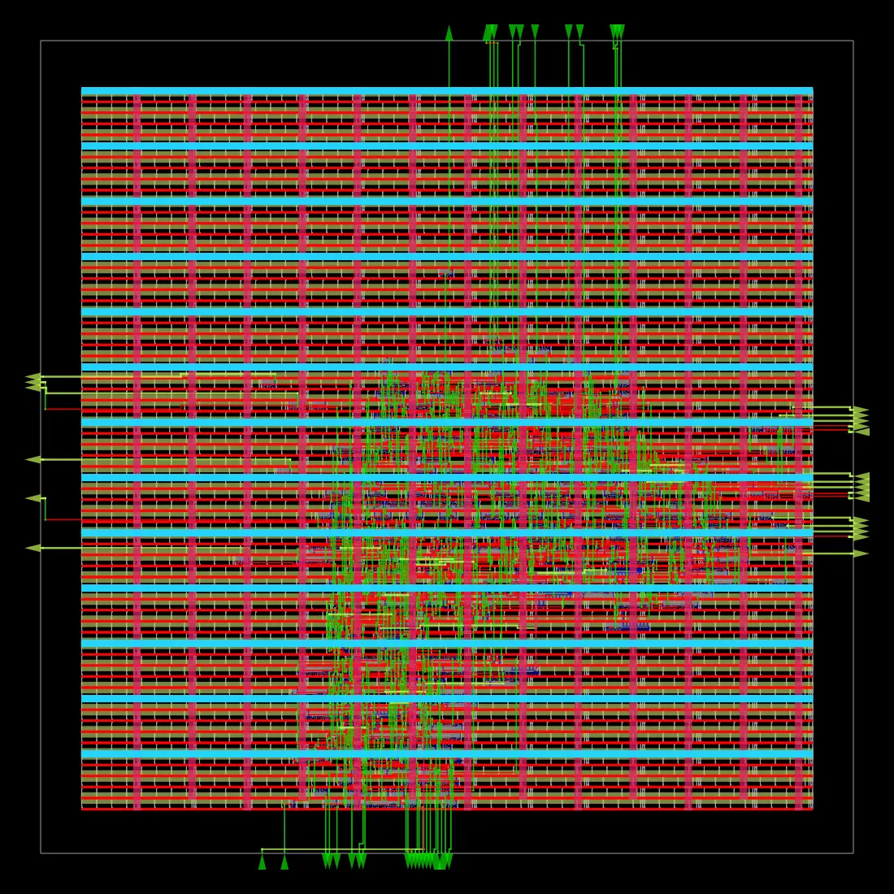
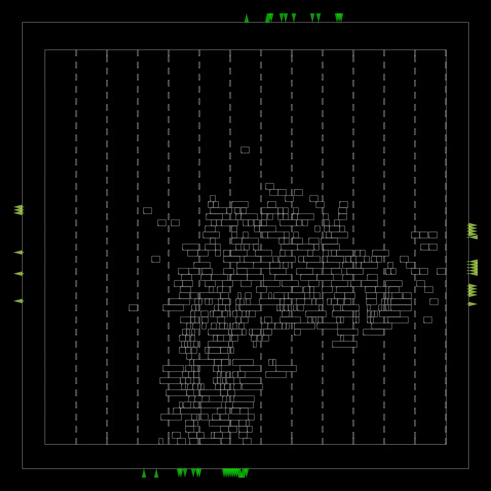
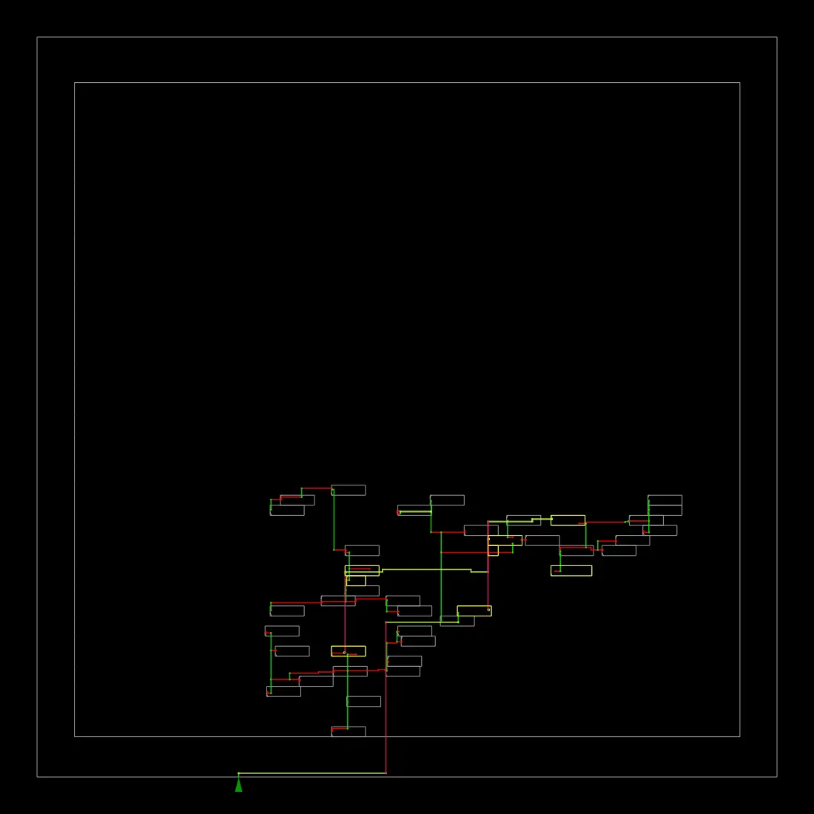
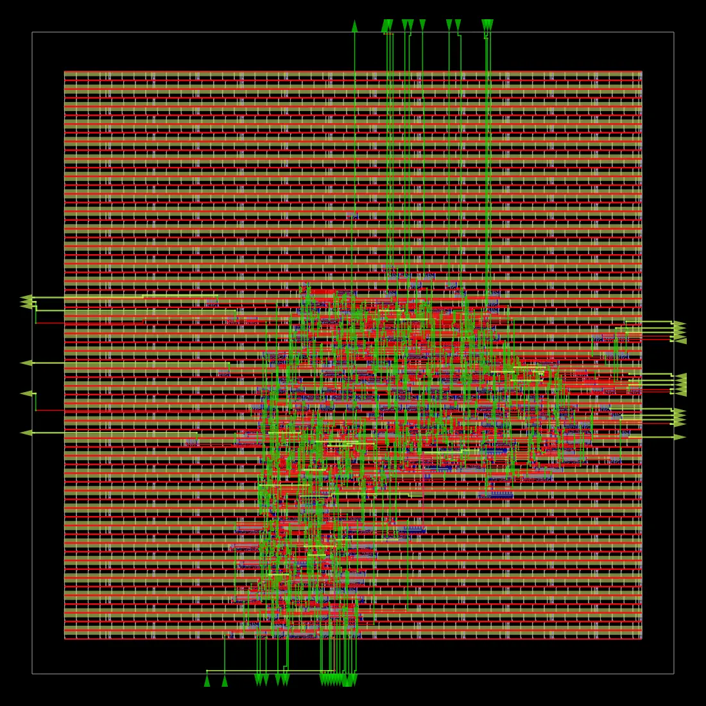
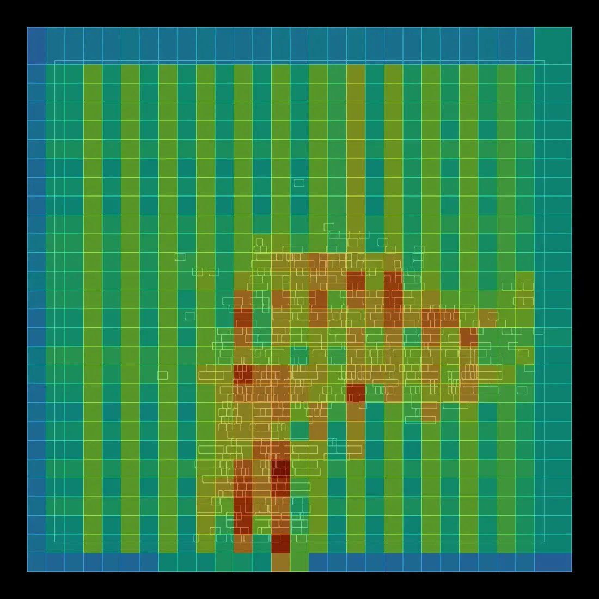
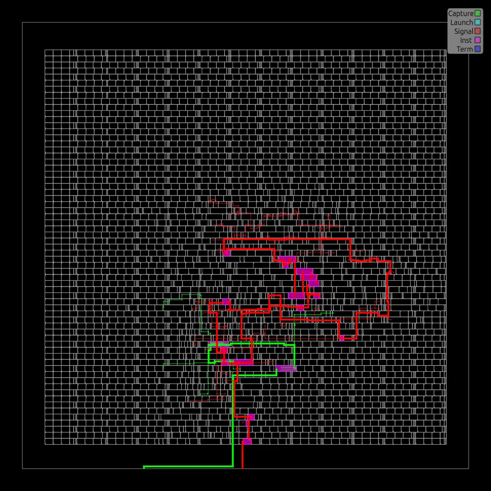
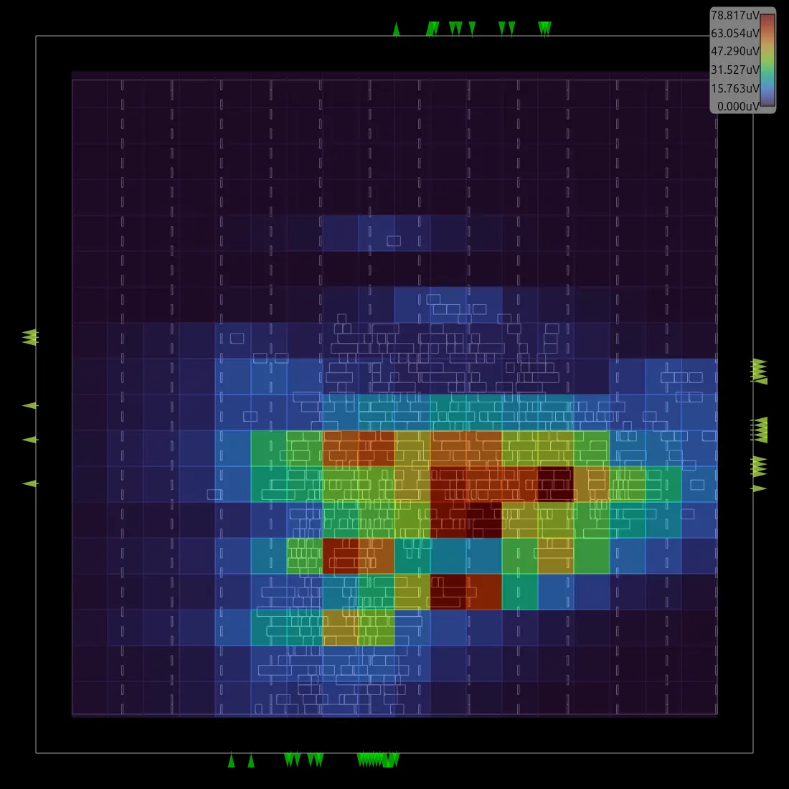
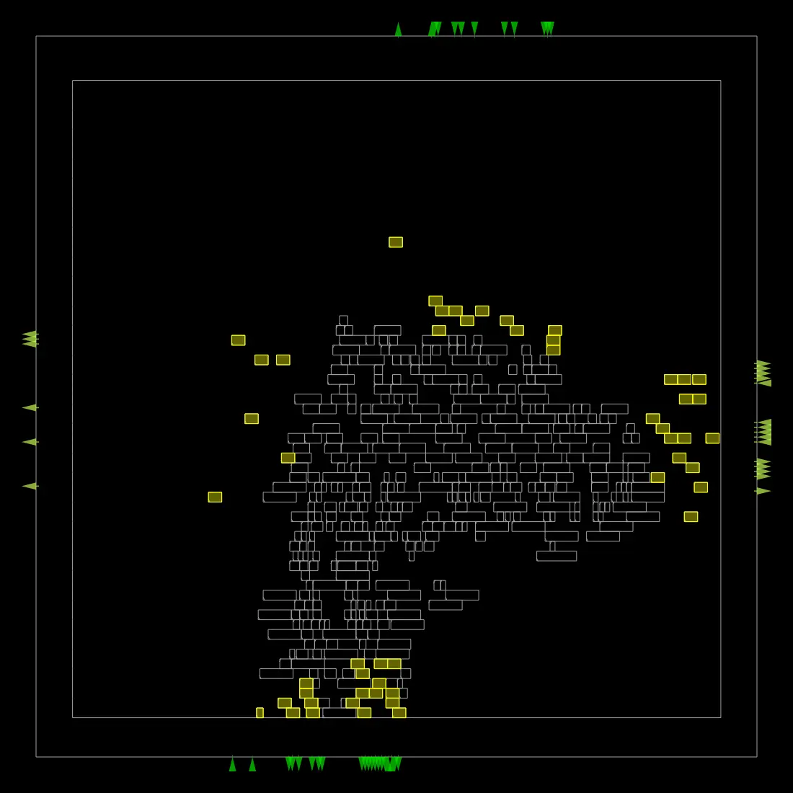

# ⚡ Low-Power 8-Bit MAC Accelerator: Complete RTL-to-GDSII ASIC Flow

[](https://github.com/google/skywater-pdk)
[](https://theopenroadproject.org/)
[](https://github.com/YosysHQ/yosys)
[]()
[](LICENSE)

An industrial-grade, end-to-end **RTL-to-GDSII Physical Implementation** of a **Low-Power 8-bit Multiply-Accumulate (MAC) Accelerator Core** targeted for the **SkyWater Sky130nm HD** (`sky130_fd_sc_hd`) standard cell technology library.

This project demonstrates the complete digital ASIC implementation lifecycle — from architectural specification and functional verification to logic synthesis, physical design (floorplanning, placement, CTS, routing), static timing analysis (STA), power/IR drop analysis, and physical verification signoff (DRC/LVS).

---

## 📊 Performance, Power & Area (PPA) Summary

| Metric | Target Specification | Achieved Result | Signoff Status |
| :--- | :--- | :--- | :---: |
| **Operating Frequency** | 100 MHz ($T_{clk} = 10.0\text{ ns}$) | **100 MHz** ($T_{clk} = 10.0\text{ ns}$) | ✅ Met |
| **Worst Setup Slack (WNS)** | $\ge 0.0\text{ ns}$ | **$+2.40\text{ ns}$ (Positive Slack)** | ✅ Closed |
| **Total Power Dissipation** | $< 2.0\text{ mW}$ | **$0.864\text{ mW}$ ($864\text{ }\mu\text{W}$)** | ✅ Met |
| **Supply Voltage ($V_{DD}$)** | $1.80\text{ V}$ nominal | **$1.80\text{ V}$** | ✅ Nominal |
| **Worst-Case IR Drop** | $< 2.0\%$ | **$7.36\times 10^{-5}\text{ V}$ ($0.00\%$ drop)** | ✅ Clean |
| **Total Die Area** | Optimized | **$5062\text{ }\mu\text{m}^2$** | ✅ Optimal |
| **Synthesized Logic Area** | Minimum | **$3889.98\text{ }\mu\text{m}^2$** | ✅ Compact |
| **Core Utilization** | $\sim 15 - 20\%$ | **$16\%$** | ✅ Congestion-Free |
| **DRC / LVS Verification** | Zero Violations | **0 DRC Errors / 431 Active Devices Matched** | ✅ Signoff Ready |

---

## 🛠️ EDA Tools & Technology Stack

- **Hardware Description:** SystemVerilog (`IEEE 1800-2017`)
- **Simulation & Verification:** Icarus Verilog, GTKWave
- **Logic Synthesis & Optimization:** Yosys Open Synthesis Suite, ABC Logic Optimizer
- **Static Timing Analysis (STA):** OpenSTA (Integrated in OpenROAD)
- **Place & Route (P&R):** OpenROAD Flow Scripts (ORFS) / OpenROAD
  - Floorplan, IO Placement, PDN Generation
  - Global Placement (RePlAce) & Detailed Placement (OpenDP)
  - Clock Tree Synthesis (TritonCTS)
  - Global Routing (FastRoute) & Detailed Routing (TritonRoute)
- **Parasitic RC Extraction:** OpenROAD RCX
- **Physical Verification:** Magic VLSI, Netgen (LVS), KLayout (`sky130hd.lydrc`)
- **PDK:** SkyWater 130nm High-Density (`sky130_fd_sc_hd`)

---

## 🔄 ASIC Implementation Flow

RTL COMPLETE (SystemVerilog)
│
▼
Waveform & Functional Verification (Icarus / GTKWave)
│
▼
RTL Lint & Semantic Check (Yosys check pass - 0 issues)
│
▼
Logic Synthesis & Mapping (Yosys + ABC -> Sky130 HD)
│
▼
Gate-Level Netlist Generation
│
▼
Static Timing Analysis Constraints (SDC @ 100 MHz, 20% IO Delay)
│
▼
Floorplanning & Power Planning (PDN: VDD/VSS 1.8V Grid)
│
▼
Placement (Global + Detailed + Tapcell Insertion)
│
▼
Clock Tree Synthesis (CTS - Skew & Latency Optimization)
│
▼
Routing (Global FastRoute -> Detailed TritonRoute)
│
▼
Signoff Verification (DRC / LVS / STA / IR Drop)
│
▼
Final Tapeout-Ready GDSII 🎯


---

## 🖼️ Physical Design Layout & Verification Gallery

### 1. Layout, Placement & Clock Distribution
| Full Chip Composite Layout | Standard Cell Placement | Clock Tree Network |
| :---: | :---: | :---: |
|  |  |  |
| *Final full-die layout stream* | *Standard cells placed at 16% density* | *Balanced clock tree network* |

### 2. Routing, Congestion & Critical Timing Path
| Detailed Routing View | Routing Congestion Map | Worst Timing Slack Path |
| :---: | :---: | :---: |
|  |  |  |
| *Metal layer routing with zero DRCs* | *Uniform routing density, no hotspots* | *Critical path timing (+2.4ns slack)* |

### 3. Power Integrity & Resizer Optimization
| Static IR Drop Analysis | Gate Resizing & Buffer Insertion |
| :---: | :---: |
|  |  |
| *Worst-case IR Drop: $0.00\%$ ($7.36\times 10^{-5}\text{ V}$)* | *Hold/Setup buffer insertion and gate sizing* |

---

## 🔍 In-Depth Engineering Highlights

### 1. Logic Synthesis & Technology Mapping (`Scripts/synth.ys`)
- **Total Logic Cells Synthesized:** 384 cells
- **Sequential Cell Area:** $825.79\text{ }\mu\text{m}^2$ ($21.23\%$ of total logic area, 33 $\times$ `sky130_fd_sc_hd__dfrtp_1` flip-flops)
- **Arithmetic & Combinational Cells:** 50 $\times$ `fa_1` (Full Adders), 41 $\times$ `ha_1` (Half Adders), 71 $\times$ `and3_1`, 38 $\times$ `nand2_1`
- **RTL Lint Check:** Clean synthesis with 0 inferred latches, 0 unmapped cells, and 0 multi-driven nets.

### 2. Timing Budgeting & SDC (`Constraints/constraint.sdc`)
```tcl
current_design mac_core

set clk_name   clk
set clk_period 10.0
set clk_io_pct 0.2

create_clock -name $clk_name -period $clk_period [get_ports clk]
set_false_path -from [get_ports rst_n]

set_input_delay  [expr $clk_period * $clk_io_pct] -clock $clk_name [get_ports {enable start a b}]
set_output_delay [expr $clk_period * $clk_io_pct] -clock $clk_name [get_ports {result done}]
Timing Closure: Closed with $+2.40\text{ ns}$ setup slack margin under nominal operating corners with zero setup/hold violations.
3. Power Integrity & IR Drop Analysis
Nominal $V_{DD}$: $1.80\text{ V}$
Worst-case Voltage ($V_{DD}$): $1.80\text{ V}$
Average IR Drop: $5.93\times 10^{-6}\text{ V}$ ($V_{DD}$) / $5.72\times 10^{-6}\text{ V}$ ($V_{SS}$)
Worst-case IR Drop: $7.36\times 10^{-5}\text{ V}$ ($0.00%$ drop), verifying absolute power rail stability.
4. Physical Verification (DRC & LVS Signoff)
DRC Signoff: Verified using KLayout SkyWater 130nm DRC deck (sky130hd.lydrc). 0 DRC errors across all routing layers (li1, met1 - met5).
LVS Signoff: Layout extraction vs. synthesized netlist via Netgen confirms 100% device-level equivalence (431 active devices matched).
📁 Repository Structure
.
├── Constraints/
│   └── constraint.sdc                # SDC timing constraints file (100 MHz target)
├── GDS/
│   └── mac_core_final.gds            # Final signoff GDSII layout stream
├── RTL/
│   └── mac_core.sv                   # Synthesizable 8-bit MAC accelerator RTL
├── Results/
│   ├── Images/                       # Layout, CTS, routing, and IR drop visual reports
│   ├── Reports/                      # Detailed STA, CTS, DRC, LVS, and area logs
│   └── Synthesis/                    # Gate-level netlist & synthesis report files
├── Scripts/
│   └── synth.ys                      # Yosys synthesis and mapping script
├── TestBench/
│   ├── mac_core_tb.sv                # Comprehensive testbench
│   └── mac_core.gtkw                 # GTKWave waveform viewer configuration
├── LICENSE                           # MIT License
└── README.md
🚀 How to Reproduce
1. Functional Simulation & Waveform Inspection
iverilog -g2012 -o mac_sim RTL/mac_core.sv TestBench/mac_core_tb.sv
vvp mac_sim
gtkwave TestBench/mac_core.gtkw
2. Logic Synthesis
yosys -s Scripts/synth.ys
3. Physical Design Flow (OpenROAD)
# Execute OpenROAD physical design flow
openroad -exit flow.tcl
👤 Author
Yuvraj Mishra

GitHub: @Venom893
LinkedIn: linkedin.com/in/your-profile
Specialization: ASIC/SoC Physical Design, RTL Design & Verification, Static Timing Analysis (STA).
