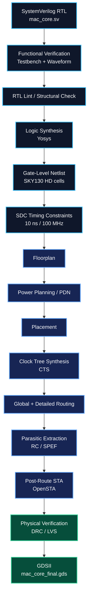

⚡ Low-Power 8-Bit MAC Accelerator — RTL-to-GDSII ASIC Flow
<p align="center">
  <strong>SystemVerilog RTL → Synthesis → Physical Design → Signoff → GDSII</strong><br>
  <em>SkyWater SKY130 HD | OpenROAD Flow Scripts | Yosys | OpenSTA | Magic | KLayout</em>
</p>
<p align="center">


</p>
---
📌 Project Overview
This project demonstrates an end-to-end digital ASIC implementation flow for a parameterized 8-bit Multiply-Accumulate (MAC) accelerator, taking synthesizable SystemVerilog RTL through simulation, synthesis, timing analysis, floorplanning, power planning, placement, clock-tree synthesis, routing, parasitic extraction, physical verification, and final GDSII generation.
The design targets the SkyWater SKY130 130 nm process using the `sky130_fd_sc_hd` high-density standard-cell library and the open-source OpenROAD Flow Scripts (ORFS) ecosystem.
The project is intentionally documented as an engineering flow rather than only as an RTL design: the repository contains RTL, testbench, timing constraints, synthesis artifacts, physical-design reports, signoff evidence, layout visualizations, and the final GDSII database.
> **Important signoff note:** The available LVS report does **not** report a clean final netlist match. It reports equal device count and equivalent cell pin lists, while identifying a net-count mismatch caused by the different treatment of `VPWR/VGND` connectivity between the synthesized logical netlist and the Magic-extracted physical netlist. This README reports that result exactly rather than incorrectly labeling LVS as “clean.”
---
🎯 Why This Project Matters
A recruiter evaluating an ASIC / SoC / Physical Design fresher can use this repository to see practical exposure to:
RTL design in SystemVerilog
Functional verification and waveform analysis
RTL synthesis and technology mapping
SDC timing constraint creation
Gate-level netlist generation
Static Timing Analysis (STA)
Floorplanning and core utilization
Power Distribution Network (PDN) concepts
Standard-cell placement
Clock Tree Synthesis (CTS)
Global and detailed routing
RC / parasitic extraction
IR-drop analysis
DRC / LVS-oriented physical verification
GDSII generation and layout inspection
Debugging and interpreting real open-source ASIC-flow reports
---
🧩 Design Architecture
The RTL implements a simple but useful MAC datapath:
[
Accumulator_{next} = Accumulator + (A \times B)
]
with operation controlled by `enable` and `start`.
Architecture at a glance
```text
                  ┌───────────────────────────┐
 a[7:0] ─────────►│                           │
                  │     Operand Isolation     │
 b[7:0] ─────────►│   enable & start gate    │
                  │                           │
                  └─────────────┬─────────────┘
                                │
                                ▼
                     ┌────────────────────┐
                     │  8 × 8 Multiplier  │
                     │   16-bit product   │
                     └─────────┬──────────┘
                               │
                               ▼
                     ┌────────────────────┐
                     │ 32-bit Accumulator │◄──────────┐
                     │  accumulator + P   │           │
                     └─────────┬──────────┘           │
                               │                      │
                               ▼                      │
                         result[31:0]                 │
                                                      │
                  clk / rst_n ────────────────────────┘

 enable ───────────────┐
 start ────────────────┤
                       ▼
                 MAC operation
                 + one-cycle done
```
RTL implementation highlights
Feature	Implementation
Operand width	8-bit `a` and `b`
Product width	16-bit
Accumulator	Parameterized 32-bit
Control	`enable`, `start`, `done`
Reset	Active-low asynchronous reset
Operand isolation	Inputs are forced to zero unless `enable && start`
Output	32-bit accumulated result
Parameters	`DATA_WIDTH`, `ACC_WIDTH`
The source is parameterized, so the datapath widths are not hard-coded into the module interface.
RTL: `RTL/mac_core.sv`
---
🔄 Complete RTL-to-GDSII Architecture

Portfolio-friendly flow
```text
RTL COMPLETE ✅
       ↓
Waveform verification
       ↓
RTL Lint / structural checks
       ↓
Logic Synthesis
       ↓
Gate-level netlist
       ↓
Static Timing Analysis / SDC
       ↓
Floorplan
       ↓
Power planning / PDN
       ↓
Placement
       ↓
Clock Tree Synthesis (CTS)
       ↓
Routing
       ↓
RC / Parasitic Extraction
       ↓
DRC / LVS / Post-route STA
       ↓
GDSII 🎯
```
---
🛠️ EDA Tools & Technologies
Category	Tool / Technology	Role
HDL	SystemVerilog	RTL implementation
Simulation	Icarus Verilog	RTL simulation
Waveform	GTKWave	Signal / functional waveform inspection
Synthesis	Yosys	RTL synthesis and technology mapping
ASIC Flow	OpenROAD Flow Scripts (ORFS)	Automated RTL-to-GDS implementation flow
Physical Design	OpenROAD	Floorplan, placement, CTS, routing, extraction and reporting
STA	OpenSTA / OpenROAD STA	Timing analysis and timing closure
Physical Verification	Magic	Layout extraction / physical verification flow
Layout / DRC support	KLayout	Layout visualization / physical verification support
PDK	SkyWater SKY130	130 nm open-source process design kit
Standard cells	`sky130_fd_sc_hd`	High-density standard-cell library
Layout format	GDSII	Final physical layout database
Constraints	SDC	Clock, input/output delay and false-path constraints
---
📊 Verified Results
The following numbers are taken from the repository's generated reports and final flow artifacts.
⏱️ Timing
Metric	Result
Target clock period	10.00 ns
Target frequency	100 MHz
Worst negative slack (WNS)	0.00 ns
Total negative slack (TNS)	0.00 ns
Worst reported slack	+2.40 ns
Minimum clock period	7.60 ns
Derived maximum frequency	131.55 MHz
Setup violations	0
Hold violations	0
Max slew violations	0
Max capacitance violations	0
Max fanout violations	0
The final report therefore shows timing closure for the 10 ns / 100 MHz target, with positive worst slack.
Detailed report: `Results/Reports/6_finish.rpt`
---
📐 Area & Cell Statistics
There are two useful area/cell views in the reports:
Synthesized design
384 synthesized standard-cell instances
450 wires
495 wire bits
8 ports
53 port bits
Technology-mapped cell area: approximately 3,889.98 µm²
Sequential-cell area: 825.792 µm²
Sequential area contribution: 21.23%
Final physical database
The final physical report includes implementation-only cells such as fill and tap cells:
Cell category	Count	Area (µm²)
Fill cells	3554	26736.89
Tap cells	435	544.27
Clock buffers	6	138.88
Timing repair buffers	54	530.51
Inverters	5	18.77
Clock inverters	2	37.54
Sequential cells	33	825.79
Multi-input combinational cells	331	2966.60
Total physical cells	4420	31799.25
The final design-area report gives:
Design area: `5062 µm²`
Utilization: `16%`
> The **384 synthesized cells**, **431 real logic devices**, and **4420 final physical cells** are not contradictory: they come from different stages and counting conventions. The final physical database includes physical-only cells such as fill and tap cells, while LVS reports 431 real logic devices.
Reports:  
`synth_stat.txt` · `final_report_summary.txt`
---
⚡ Power & IR-Drop Analysis
The final IR report shows:
Metric	VDD Result
Supply voltage	1.80 V
Total power in IR report	8.64 × 10⁻⁴ W
Average IR drop	5.93 µV
Worst-case IR drop	73.6 µV
Reported percentage drop	0.00%
The same report also confirms that all shapes on both `VDD` and `VSS` are connected.
The CTS-stage power report separately reports approximately 8.88 × 10⁻⁴ W total power. These are different report-stage estimates, so this README does not incorrectly merge them into one number.
Report: `Results/Reports/final_report_summary.txt`
---
🧪 Verification & Signoff Evidence
RTL / Synthesis Check
The synthesis check reports:
```text
Executing CHECK pass (checking for obvious problems).
Checking module mac_core...
Found and reported 0 problems.
```
Report: `Results/Reports/synth_check.txt`
---
Functional Verification
The testbench explicitly exercises:
Reset behavior
First MAC operation: `3 × 4 = 12`
Accumulation: `12 + (5 × 6) = 42`
`enable` control
`start` control
Another MAC operation resulting in `98`
Testbench: `TestBench/mac_core_tb.sv`
Waveform evidence

Open the GTKWave verification waveform
---
🧭 Physical Design Stages
1. Floorplanning
The design was taken from the synthesized gate-level representation into the physical implementation flow, establishing the core area, placement rows and physical design environment.
Visual: `final_placement.webp`
---
2. Power Planning / PDN
Power connectivity was implemented for the physical design, followed by IR-drop analysis on the final database.
The final report confirms:
`VDD` shapes connected
`VSS` shapes connected
Worst-case VDD IR drop: 73.6 µV
Reported VDD percentage drop: 0.00%
Visual: `final_ir_drop.webp`
---
3. Placement
Standard cells were physically placed within the core.

Open placement view
---
4. Clock Tree Synthesis
The CTS reports show:
Dedicated clock buffers inserted
Setup violation count: 0
Hold violation count: 0
Max slew violation count: 0
Max capacitance violation count: 0
Max fanout violation count: 0
The final physical database contains 6 clock-buffer cells in the final cell-category report.

Open CTS view
Detailed report: `4_cts_final.rpt`
---
5. Routing
Global and detailed routing were completed, followed by RC/parasitic extraction.
The final extraction report records:
3951 wires processed for extraction
539 nets
2277 RC segments
2277 capacitances
3055 coupling capacitances

Open routing view
---
🔍 Physical Verification
DRC
The repository contains a final DRC report with:
```text
0
```
This is consistent with the final DRC result captured in the project evidence.
Report: `Results/Reports/drc_report.txt`
---
LVS — Important Engineering Note
The LVS report requires careful interpretation.
Reported comparison
Metric	Layout	Synthesized Netlist
Devices	431	431
Nets	544	2266
Cell pin lists	Equivalent	Equivalent
Device classes	Equivalent	Equivalent
Automated final result	Netlists do not match	—
The report explicitly states that all 431 real logic devices match and that the cell pin/port lists match exactly.
It attributes the net-count difference to the treatment of `VPWR/VGND` power connectivity:
the Yosys/ORFS synthesized Verilog does not explicitly model the same power connectivity;
the Magic-extracted physical netlist includes that physical power connectivity.
Therefore, this project should not claim “LVS clean” or “tapeout signoff clean.” The accurate claim is:
> **Device-level LVS equivalence was confirmed for all 431 real logic devices and cell pin/port lists, while the final automated netlist comparison reports a power-net-related net-count mismatch.**
That distinction is intentionally documented here because accurate signoff reporting is more valuable than overstating results.
Full LVS report: `Results/Reports/lvs_summary.txt`
---
🖼️ Physical Implementation Gallery
Click any image to open the full-resolution repository asset.
Final Layout

Placement

Clock Tree

Routing

Congestion

IR Drop

Worst Timing Path

GDSII Layout View
Open GDSII layout PDF
---
📁 Repository Structure
```text
Low-Power-MAC-Sky130--RTL-to-GDSII/
│
├── Constraints/
│   └── constraint.sdc
│
├── GDS/
│   └── mac_core_final.gds
│
├── RTL/
│   └── mac_core.sv
│
├── TestBench/
│   ├── mac_core_tb.sv
│   └── mac_core.gtkw
│
├── Scripts/
│   └── synth.ys
│
├── Results/
│   ├── Images/
│   │   ├── final_all.webp
│   │   ├── final_clocks.webp
│   │   ├── final_congestion.webp
│   │   ├── final_ir_drop.webp
│   │   ├── final_placement.webp
│   │   ├── final_resizer.webp
│   │   ├── final_routing.webp
│   │   ├── final_worst_path.webp
│   │   ├── gdsii_layoutview.pdf
│   │   └── gtk_verification_waveform.pdf
│   │
│   ├── Reports/
│   │   ├── 4_cts_final.rpt
│   │   ├── 6_finish.rpt
│   │   ├── drc_report.txt
│   │   ├── final_report_summary.txt
│   │   ├── lvs_summary.txt
│   │   ├── synth_check.txt
│   │   └── synth_stat.txt
│   │
│   └── Synthesis/
│       ├── mac_core_synth.v
│       └── synthesis_report.txt
│
├── README.md
└── LICENSE
```
---
⏱️ Timing Constraints
The project uses an SDC constraint file with a 10 ns clock period, corresponding to a 100 MHz target.
Key constraints include:
```tcl
current_design mac_core

set clk_name   clk
set clk_period 10.0
set clk_io_pct 0.2

create_clock -name $clk_name -period $clk_period [get_ports clk]

set_false_path -from [get_ports rst_n]

set_input_delay \
    [expr $clk_period * $clk_io_pct] \
    -clock $clk_name \
    [get_ports {enable start a b}]

set_output_delay \
    [expr $clk_period * $clk_io_pct] \
    -clock $clk_name \
    [get_ports {result done}]
```
Constraint file: `Constraints/constraint.sdc`
---
▶️ Reproducibility
1. RTL simulation
```bash
iverilog -g2012 \
  -o mac_sim \
  TestBench/mac_core_tb.sv \
  RTL/mac_core.sv

vvp mac_sim

gtkwave TestBench/mac_core.gtkw
```
---
2. Logic synthesis
```bash
yosys -s Scripts/synth.ys
```
The synthesis script maps the RTL into the SKY130 high-density standard-cell library.
Script: `Scripts/synth.ys`
---
3. Physical implementation
The physical implementation is driven through the OpenROAD Flow Scripts environment using the SKY130 HD platform.
The exact flow configuration and environment depend on the local ORFS / PDK installation.
---
🧠 Engineering Skills Demonstrated
Digital Design
SystemVerilog RTL
Parameterized datapath design
Sequential logic
Combinational logic
Accumulator architecture
Control/handshake signals
Reset design
Operand isolation
Verification
Testbench development
Directed functional tests
Simulation
Waveform analysis
Reset verification
Enable/start control verification
Accumulation correctness checking
Synthesis & Timing
Yosys synthesis
Technology mapping
SKY130 standard-cell libraries
SDC constraints
Clock definition
Input/output delay constraints
False-path constraints
Gate-level netlist inspection
Static Timing Analysis
Setup/hold analysis
WNS/TNS interpretation
Clock skew analysis
Physical Design
Floorplanning
Core utilization analysis
Power planning / PDN
Standard-cell placement
Clock Tree Synthesis
Clock buffer insertion
Global routing
Detailed routing
Parasitic extraction
RC analysis
IR-drop analysis
Physical Verification
DRC result interpretation
LVS result interpretation
Device-level equivalence analysis
Power-net connectivity debugging
GDSII generation
Final layout inspection
---
📈 Key Results at a Glance
Category	Result
Process	SKY130 / 130 nm
Standard-cell library	sky130_fd_sc_hd
RTL	SystemVerilog
MAC operands	8-bit × 8-bit
Accumulator	32-bit
Clock target	100 MHz / 10 ns
WNS	0.00 ns TNS / +2.40 ns worst slack
Minimum clock period	7.60 ns
Derived Fmax	131.55 MHz
Synthesized cells	384
Real logic devices in LVS	431
Final physical cells	4420
Design area	5062 µm²
Synthesized logic-cell area	3889.98 µm²
Utilization	16%
Final IR-report power	0.864 mW
Worst VDD IR drop	73.6 µV
DRC report	0 violations reported
LVS	431/431 devices equivalent; net-count mismatch remains
Final GDSII	Generated
---
📦 Final Deliverables
Source & Design
SystemVerilog RTL
Testbench
Timing constraints
Yosys synthesis script
Reports
Synthesis statistics
Synthesis check
CTS report
Final implementation report
Final power / IR / area report
DRC report
LVS summary
Layout & Verification
Final layout
Placement
CTS visualization
Routing
Congestion
IR-drop visualization
Worst timing path
GDSII layout PDF
GTKWave verification
Final GDSII
