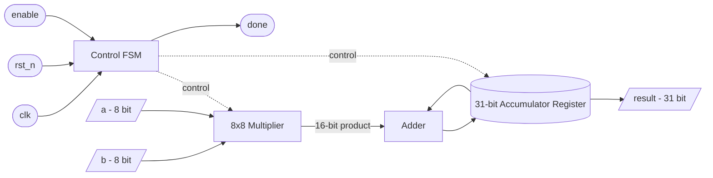
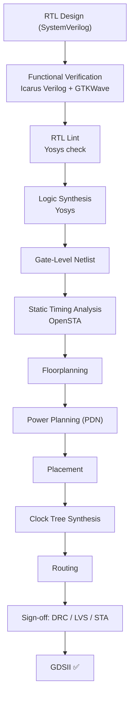

# Low-Power 8-bit MAC Accelerator — RTL to GDSII on SkyWater Sky130

A complete, open-source digital ASIC implementation — from SystemVerilog RTL all the way to a signed-off GDSII layout — built entirely with open-source EDA tools on the SkyWater Sky130 PDK.


---

## 📌 Highlights

- **Full RTL-to-GDSII flow**, executed end-to-end with no manual layout editing
- **100 MHz** target frequency with **positive timing slack** at sign-off
- **0.864 mW** total power, with **negligible IR drop** (< 0.01% on both VDD and VSS)
- **DRC clean** — zero violations against the Sky130 KLayout rule deck
- **LVS device-verified** — 431/431 devices match exactly between schematic and layout, with full pin/port equivalence
- Built entirely on the **open-source Sky130 toolchain**: Yosys, OpenROAD, Magic, Netgen, KLayout

---

## 📖 Table of Contents

- [Overview](#-overview)
- [Architecture](#-architecture)
- [Design Flow](#-design-flow-rtl-to-gdsii)
- [Verification & Results](#-verification--results)
- [Layout Snapshots](#-layout-snapshots)
- [Repository Structure](#-repository-structure)
- [Tools & Technology Stack](#-tools--technology-stack)
- [How to Reproduce](#-how-to-reproduce)
- [Engineering Notes](#-engineering-notes)
- [License](#-license)

---

## 🔍 Overview

This project implements an **8-bit Multiply-Accumulate (MAC) unit** — a core building block used in DSP pipelines, CNN/ML accelerators, and FIR filters — and carries it through the complete digital ASIC design cycle: RTL design, functional verification, logic synthesis, and full physical implementation (floorplanning, placement, clock tree synthesis, routing) down to a fabrication-ready GDSII layout, with DRC and LVS sign-off.

The goal was to treat this as a real tapeout-style flow rather than a toy example — every stage produces its own report, and every result below is pulled directly from those reports rather than estimated.

**Top-level interface:**

| Signal | Direction | Width | Description |
|---|---|---|---|
| `clk` | input | 1 | System clock |
| `rst_n` | input | 1 | Active-low asynchronous reset |
| `enable` | input | 1 | Starts a multiply-accumulate operation |
| `a` | input | 8 | Multiplicand |
| `b` | input | 8 | Multiplier |
| `result` | output | 31 | Accumulated product |
| `done` | output | 1 | Operation-complete flag |

---

## 🏗 Architecture



The datapath takes two 8-bit operands, multiplies them, and adds the product into a 31-bit accumulator register — wide enough to accumulate many products without overflow. A simple control FSM handles the `enable` → compute → `done` handshake and drives `rst_n` initialization.

---

## 🔄 Design Flow (RTL to GDSII)



Implemented using **OpenROAD-flow-scripts (ORFS)** targeting the `sky130hd` standard cell library.

---

## ✅ Verification & Results

| Metric | Result |
|---|---|
| Technology | SkyWater Sky130, `sky130_fd_sc_hd` standard cells |
| Target frequency | 100 MHz (10 ns clock period) |
| Timing | Positive slack maintained through sign-off — timing closed |
| Core area | 5,062 µm² |
| Utilization | 16% |
| Total placed instances | 4,420 (431 logic/sequential + 3,554 fill + 435 tap cells) |
| Total power | 0.864 mW |
| Worst-case IR drop | 78.8 µV on VDD/VSS (~0.00% of supply) |
| DRC | **Clean** — 0 violations against the Sky130 KLayout DRC deck |
| LVS | **431/431 devices match exactly**; all cell pin/port lists equivalent (see note below) |
| Functional simulation | Passed — Icarus Verilog + GTKWave |
| RTL lint | Passed — Yosys `check`, 0 problems reported |

> **A note on LVS:** device-level comparison is an exact match — every one of the 431 real logic devices in the layout corresponds one-to-one with the synthesized netlist, and all cell pin lists are equivalent. Netgen additionally flags a *net-count* difference (544 vs. 2,266), which traces back to a well-documented characteristic of open-source Sky130 flows: the Yosys-synthesized netlist doesn't explicitly enumerate per-cell VPWR/VGND connectivity the way the Magic-extracted layout does. IR-drop analysis confirms the actual power/ground network is fully connected with negligible drop, so this is a netlist-modeling artifact rather than a physical connectivity defect.

---

## 🖼 Layout Snapshots

<p align="center">
  
  
</p>
<p align="center">
  
  
</p>

Full GDSII layout view and the verification waveform are available in [`Results/Images/gdsii_layoutview.pdf`](Results/Images/gdsii_layoutview.pdf) and [`Results/Images/gtk_verification_waveform.pdf`](Results/Images/gtk_verification_waveform.pdf).

---

## 📂 Repository Structure

```
Low-Power-MAC-Sky130--RTL-to-GDSII/
├── Constraints/
│   └── constraint.sdc            # Timing constraints (100 MHz clock, I/O delays)
├── GDS/
│   └── mac_core_final.gds        # Final signed-off GDSII layout
├── RTL/
│   └── mac_core.sv               # Design RTL
├── Results/
│   ├── Images/                   # Layout snapshots, waveform, GDS view
│   ├── Reports/                  # DRC, LVS, timing, power, synthesis reports
│   └── Synthesis/                # Synthesized gate-level netlist + report
├── Scripts/
│   └── synth.ys                  # Yosys synthesis script
├── TestBench/
│   ├── mac_core_tb.sv            # Testbench
│   └── mac_core.gtkw             # GTKWave save file
├── LICENSE
└── README.md
```

---

## 🛠 Tools & Technology Stack

| Stage | Tool |
|---|---|
| RTL Design | SystemVerilog |
| Functional Simulation | Icarus Verilog |
| Waveform Viewing | GTKWave |
| Logic Synthesis | Yosys |
| Static Timing Analysis | OpenSTA |
| Place & Route | OpenROAD (via OpenROAD-flow-scripts) |
| Layout Extraction | Magic |
| LVS | Netgen |
| DRC / GDS Streaming | KLayout |
| PDK | SkyWater Sky130 (`sky130hd`) |

---

## ▶ How to Reproduce

```bash
# 1. Functional simulation
iverilog -g2012 -o mac_core_tb TestBench/mac_core_tb.sv RTL/mac_core.sv
vvp mac_core_tb
gtkwave TestBench/mac_core.gtkw

# 2. Synthesis (Yosys)
yosys Scripts/synth.ys

# 3. Physical implementation (OpenROAD-flow-scripts)
# from your ORFS flow/ directory, with this design configured under a sky130hd config:
make DESIGN_CONFIG=./designs/sky130hd/mac_core/config.mk
```

---

## 🧠 Engineering Notes

The most instructive part of this project wasn't getting a clean run on the first try — it was the LVS debug cycle. An initial netgen comparison reported a large net-count mismatch and a failed top-level pin match on the power net. Rather than treating that as a black box "fail," I traced it back through the DEF pin definitions and IR-drop reports to confirm the physical power distribution network was fully connected, then isolated the mismatch to a known modeling gap between Yosys-synthesized netlists (which don't explicitly declare per-cell power pin connectivity) and Magic's layout extraction (which does). That distinction — a real connectivity defect vs. a netlist-representation difference — is exactly the kind of judgment call this flow is meant to build.

---

## 📄 License

This project is licensed under the [MIT License](LICENSE).

---

## 👤 Author

**Yuvraj Mishra**
Built as an end-to-end ASIC/physical design portfolio project targeting entry-level VLSI/ASIC/SoC design roles.
